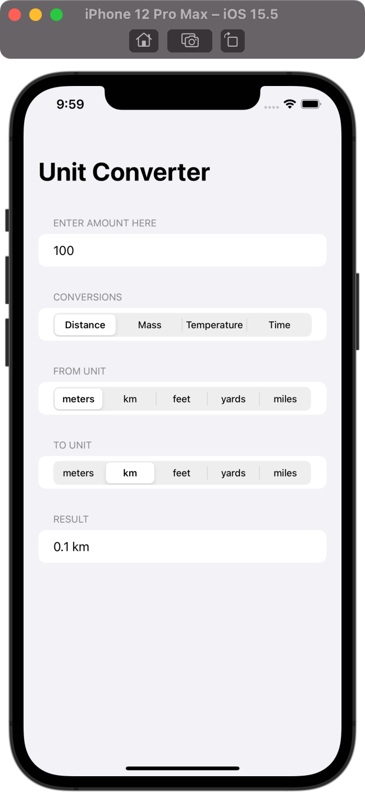
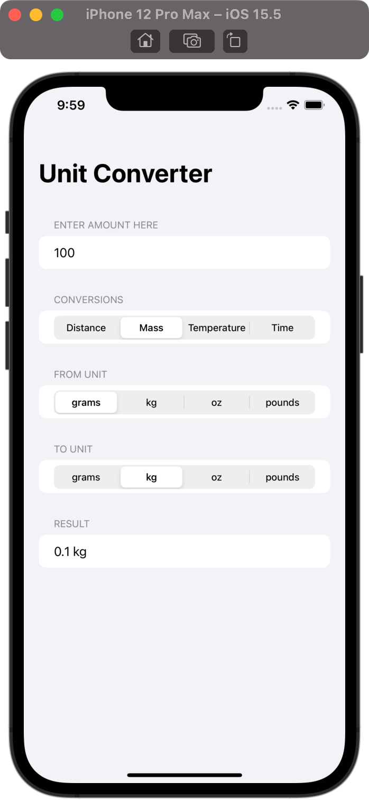
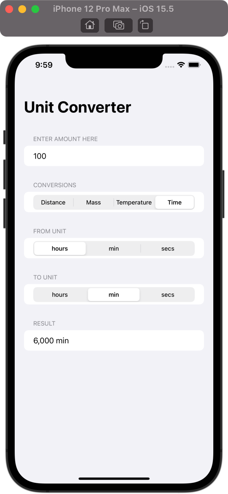

# Unit Converter App

## Project Description

The project is a part of 100 Days of SwiftUI curriculum by Paul Hudson [Hacking with swift](https://www.hackingwithswift.com/100/swiftui)

The app converts different measurement units such as kilometers, meters, yards etc.
Current project includes following measurements:

- Distance
- Mass
- Temperature
- Time

The project can easily be extended by adding necessary Strings to conversions array:
```swift
let conversions = ["Distance", "Mass", "Temperature", "Time"]
```
and units to unitTypes array:
```swift
let unitTypes = [
        [UnitLength.meters, UnitLength.kilometers, UnitLength.feet, UnitLength.yards, UnitLength.miles],
        [UnitMass.grams, UnitMass.kilograms, UnitMass.ounces, UnitMass.pounds],
        [UnitTemperature.celsius, UnitTemperature.fahrenheit, UnitTemperature.kelvin],
        [UnitDuration.hours, UnitDuration.minutes, UnitDuration.seconds]
    ]
```
In case of additions you might need to change segmented picker to default one to fit all the choices by removing line containing:
```swift
.pickerStyle(.segmented)
```
## Project Screen

      
