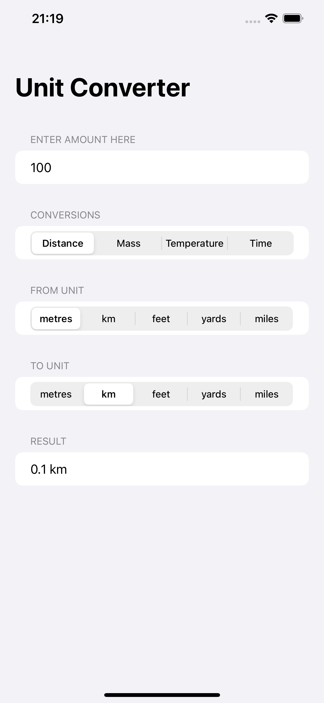

# Unit Converter App

## Project Description

The project is a part of 100 Days of SwiftUI curriculum by Paul Hudson [Hacking with swift](https://www.hackingwithswift.com)

The main functionality of the app is to convert between different measurement units such as kilometers, meters, yards etc.
Current project covers following measurements:

- Distance
- Mass
- Temperature
- Time

But, can be easily extended by adding necessary units to unitTypes array.
In case of additions you might need to change segmented picker to default one to fit all the choices.

## Project Screen

